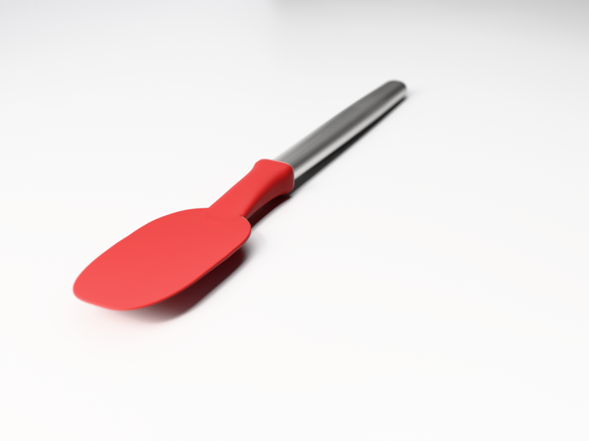

# Procedural spatula (Blender)

An ultra-realistic silicone spoon-spatula — deep-red molded silicone head,
brushed stainless handle — generated entirely from Python with Blender's
`bpy` module. No image textures, no downloaded assets: parametric geometry,
procedural PBR shaders, studio three-point lighting, Cycles render.



## Outputs

| File | What it is |
|---|---|
| `public/images/spatula.png` | Final Cycles render (1920×1440, 320 samples, denoised) |
| `public/models/spatula.glb` | Exported 3D model (usable with `three.js` / `<model-viewer>`) |
| `blender/spatula/generate_spatula.py` | The generator — rebuilds everything from scratch |

## How it's built

- **Head** — one continuous mesh: a star-shaped superellipse paddle
  (~60×122 mm) with a smooth, gently dished working face, all stiffening
  thickness pushed to an underside spine, a thin 0.9 mm front flex lip,
  sub-mm molded edge waviness, and a monotonic neck that ends in a crisp
  overmold collar wrapping the steel tube.
- **Handle** — lofted oval stainless tube with a subtle barrel swell where
  the palm sits, a scored seam groove before the domed end cap, and a
  boolean hanging hole.
- **Silicone shader** — procedural: matte roughness mottle, satin micro
  grain, sparse dust specks, subsurface scattering that glows at the thin
  backlit edges, shader-level edge rounding (Bevel node).
- **Steel shader** — anisotropic brushed metal (radial tangent), stretched
  noise brushing bump, blotchy handling smudges on roughness and tint.
- **Set** — white seamless sweep with mottled roughness, softbox key,
  faint cool fill, raking rim for the SSS edge glow, an overhead strip for
  the long streak on the steel, and a camera-invisible black flag card so
  the metal keeps a dark gradient against the white set.
- **Look** — Khronos PBR Neutral view transform (color-faithful product
  rendering), 56 mm lens at f/6.3 with a 9-blade aperture.

## Reproduce

```bash
python3 -m venv bpyenv && ./bpyenv/bin/pip install bpy  # Blender 5.x headless
./bpyenv/bin/python generate_spatula.py -- \
  --out spatula.png --res 1920 1440 --samples 320 \
  --blend spatula.blend --glb spatula.glb
```

CPU-only render takes ~15 min at these settings; drop `--res 1280 960
--samples 96` for ~2-minute previews.
